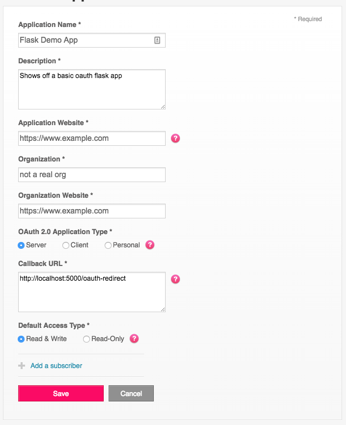

#Fitbit OAuth Flask Template

This project defines a basic structure to make applications based
on the Fitbit API. It is written in Python 3.5

It defines an app structure that will give you a database, a login form, and 
a very basic registration form.

The Flask Structure is from [Miguel Grinberg's Book](http://shop.oreilly.com/product/0636920031116.do) 

[Repo For His Book Here](https://github.com/miguelgrinberg/flasky)

If you wish to learn more about Flask check it out. Or the [Flask Project Page](http://flask.pocoo.org/)
 
[Read More About the Fitbit API](https://dev.fitbit.com/docs/)

## Developing Your Own App

First fork this repo

Then create a [Fitbit App Config](https://dev.fitbit.com/apps/new). 

This is the config I used while developing. Your app may not need read/write access.



Once you have that you need to define some environment variables

Here are mine (with secrets faked. Your app will have its own values for most of these). Almost all should 
be treated with care because if they are leaked your app will be compromised

```
# Retrieved from dev.fitbit.com/apps/ for the app created earlier
FITBIT_CLIENT_ID=217sdd2
FITBIT_CLIENT_SECRET=321cb9d7g7f8b3c0bf1e24c50169f11
# Key used for CSRF protection
SECRET_KEY=sdasdas
# Signal to the app to use the development config defined in config.py
# When running tests this should be set to 'testing'
FLASK_CONFIG=development
```

After defining those you are ready to setup development.

While the app uses sqlite for development its is designed to eventually be deployed to Heroku and requires Postgres to be installed. You should be able to install this with your package manager of choice. If you don't care about Heroku and dont intend to use Postgres for your production app you can remove the dependency `psycopg2` from `requirements.txt`

```
# Create a virtual environment for 
pyvenv venv
source venv/bin/activate
pip install -r requirements.txt
```
Finally, you should decide on the OAuth scopes for your project. Specifically, define what data your app will
be accessing from people's Fitbit accounts. These are defined in fitbit.py. This example only uses the profile
scope. Your app will almost certainly need more than that.

[Read more about OAuth Scopes](https://dev.fitbit.com/docs/oauth2/)

Almost there. The first time you run the app you need to create the database. With your virtual environment activated run
```
python manage.py createdb
```

Finally to run the app simply make sure your virtual environment is active and run

```
python manage.py
 * Running on http://127.0.0.1:5000/ (Press CTRL+C to quit)
 * Restarting with stat
 * Debugger is active!
 * Debugger pin code: 129-285-482
```

This app has been put on heroku so you should be able to get it working there as well.

The app as written will only access your fitbit profile to demonstrate OAuth working.
[Try It Out](https://fitbitdemo.herokuapp.com/)
